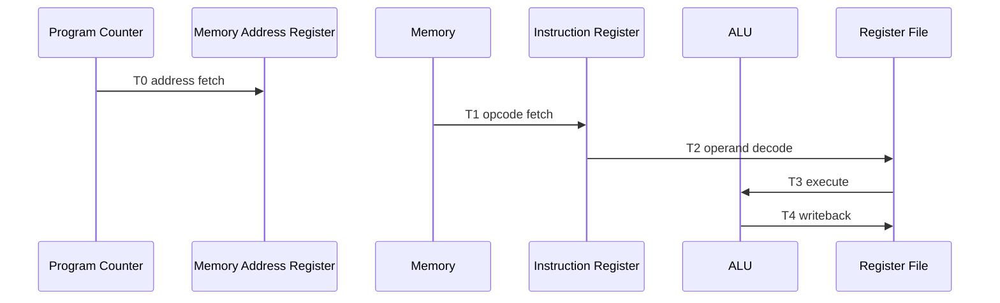

# MICROCODE

## Design

OZZ-8BIT models microcode as an abstract sequence of micro-operations rather than a direct copy of legacy MK1 control lines. This keeps the software reference architecture independent from the inherited TTL wiring and makes the control flow readable for students.

## Execution Structure

Each instruction begins with a two-step fetch:

1. `PC -> MAR`
2. `MEM[MAR] -> IR, PC <- PC + 1`

The remaining microsteps depend on the instruction mode.

## Timing Diagram



## Interrupt Flow


## Files

- `microcode/microcode_tables.py`
- `microcode/microcode_generator.py`
- `microcode/microcode_export.py`

## Export Commands

```powershell
python -m microcode.microcode_generator --format text --output build/microcode.txt
python -m microcode.microcode_generator --format json --output build/microcode.json
python -m microcode.microcode_export --format markdown --output build/microcode.md
```
