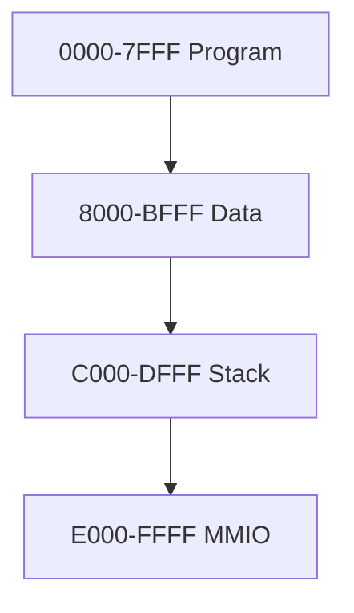

# Architecture Guide

## Philosophy

OZZ-8BIT is designed as an educational machine, not a compatibility layer for the legacy MK1 CPU. The goal is to keep the control flow readable, the memory model realistic enough to matter, and the tooling small enough to study.

## Register Layout

| Register | Width | Purpose |
| --- | --- | --- |
| `A` | 8 | Accumulator |
| `B` | 8 | General-purpose arithmetic register |
| `X` | 16 | Indexed addressing |
| `Y` | 16 | Indexed addressing |
| `SP` | 16 | Stack pointer |
| `PC` | 16 | Program counter |
| `FLAGS` | 8 | Status flags |
| `TEMP` | 8 | Internal scratch |
| `IR` | 8 | Instruction register |

## Memory Map

## Interrupts

- `INT n` indexes into the interrupt vector table at `0xFFF0 + n * 2`.
- `IRET` restores `FLAGS` and `PC`.
- `IF` gates interrupt servicing.
