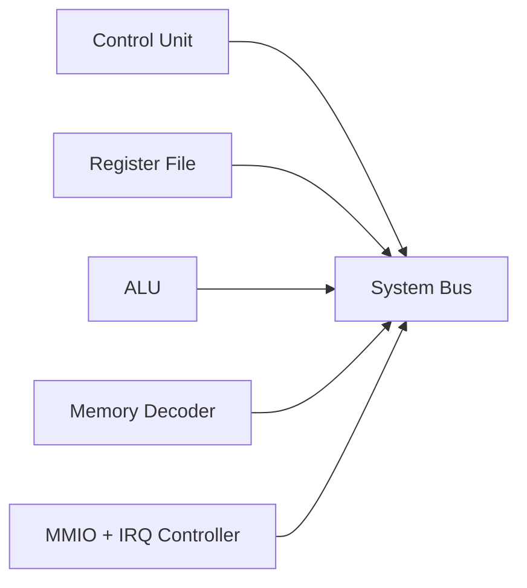

# Hardware Guide

## Direction

The OZZ-8BIT hardware plan moves away from the tightly coupled MK1 module layout toward a cleaner modular bus architecture with memory-mapped I/O and explicit interrupt handling.

## Target Blocks

